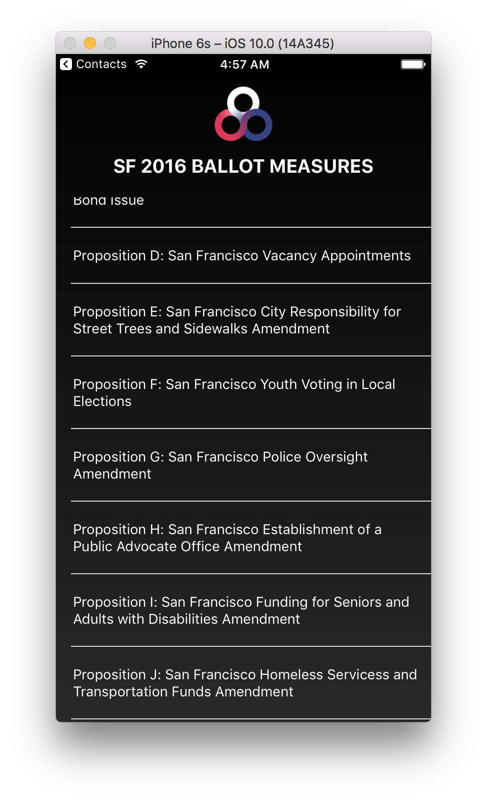
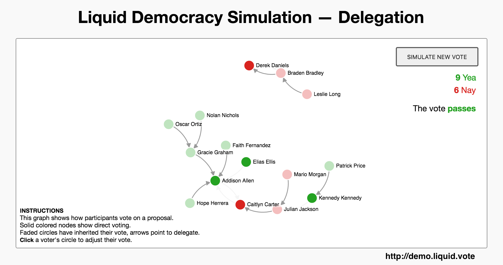
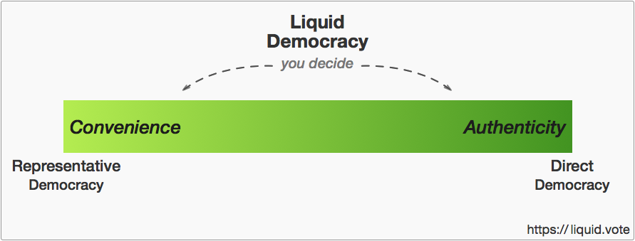
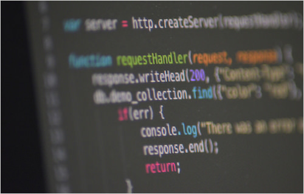
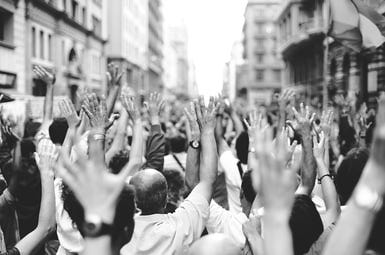
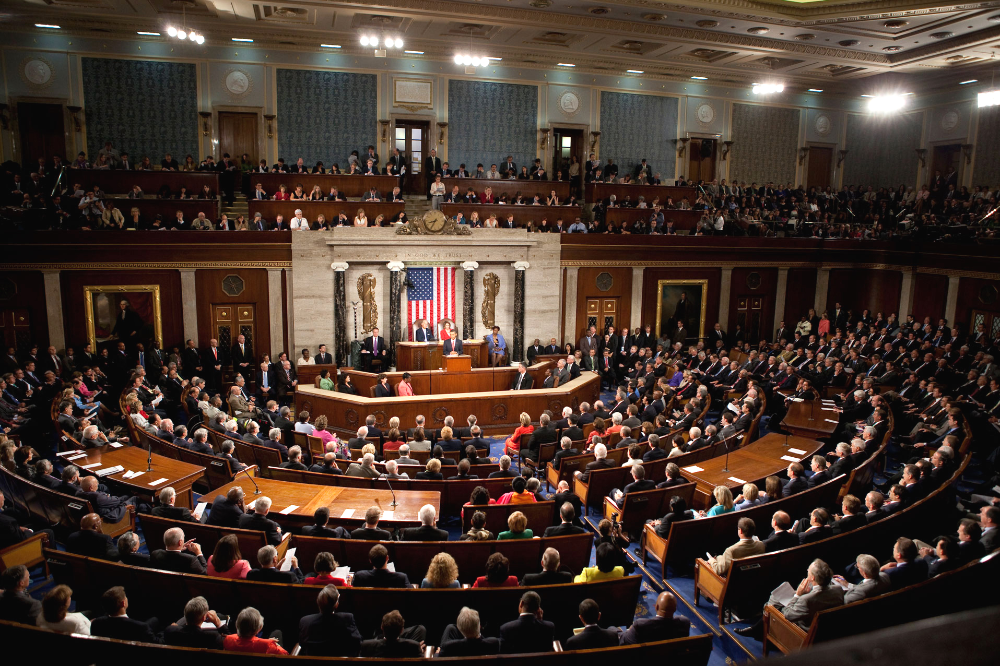

# Liquid Democracy: A 21st Century Experiment for Healthier Politics

## Who are we?

Hi,

We're David Ernst, Jared Scheib, and Rohan Dixit.

At heart, we're technologists. We believe in the future, and we work each day to create new technology to make our friends' and families' lives better.

We've also been politically involved. We've phone banked and canvassed. We've donated and shared all sorts of issue-driven campaigns.

But we've also come up against more systemic problems. And we're not alone. Congressional approval ratings are at an all time low. All across America, people complain that politics is broken.

We've felt it too. Sometimes it feels really frustrating. But rather than being paralyzed with despair, we're working to offer a more constructive alternative.

And that's how we came to Liquid Democracy.

## What is Liquid Democracy?

Liquid Democracy is a hybrid of Representative and Direct Democracy that promises to empower our most trustworthy leaders, give us true choice and political accountability, and transform our politics and society.

### Liquid Democracy changes the way we create legislation

Right now, "democracy" means once every few years, citizens can go to their polling place to pick one of a few options as political representatives, who then vote for them in the legislature. In other words, for 99.9% of Americans, democracy means choosing simply between Candidate A or Candidate B. The range of our political perspectives is reduced down into a single binary decision.

But lately, as our country has become incredibly polarized, democracy has become "my team versus your team". Campaigns are dominated with messaging attacking the other side as deceptive, corrupt, or just plain stupid. Often, we're expected to make the choice between the "lesser of two evils", but what sort of choice is that? Tribalism and fear have taken over, while the issues that most affect us have taken the back-seat.

### A Liquid Democracy works differently.

In the middle of the Civil War, when our country was as divided as it's ever been, President Abraham Lincoln said that it was Americans' responsibility to ensure that "*government of the people, by the people, for the people, shall not perish from the earth*".

Inspired by this, Liquid Democracy gives voters the option to vote directly on any piece of legislation, if they so choose.

But realistically, who has time for that? At large scales, Representative Democracy is an important innovation, for good reason. It's very hard to stay on top of all the ins and outs of policy, and the quality of decision making suffers.

And so Liquid Democracy lets you pick other people to vote on your behalf too. But an important difference is that you're no longer stuck picking from just a few choices on a ballot. Instead, you can pick *anyone* who lives in your district. Anyone you already know and trust. If you could pick anyone to make policy decisions — and they don't even have to quit their jobs — who might you choose? With your permission, they can now vote on your behalf.

<!--  -->

This is because representation in Liquid Democracy works differently than how we currently elect people. Instead of voting as a district on just a single Congressperson to try to "represent" the interests of nearly a million people, Liquid Democracy lets each person come to their own conclusion about who is best to represent them.

### No more elections

Right now, a candidate who gets only 51% of their district's vote still goes to the legislature to represent 100% of the people, even if you didn't personally vote for them.

This leads to incredibly high-stakes campaigns. You either win, and get it all, or you lose, and go home with nothing. No wonder campaigns can become so nasty. No wonder candidates often take campaign funding from groups they'd otherwise rather not deal with.

And it's this systemic pressure that entrenches a two-party duopoly. Individuals want their vote to have an impact, but strategy suggests that picking a third party candidate means "wasting your vote".

Liquid Democracy is different. You pick a delegate that's right for you. No one else picks for you. And your delegate has their own delegate, who has their own delegate, who has their own delegate. This creates a more organic network of trust, where individuals can choose to vote on the issues they feel knowledgeable about, rather than an extreme concentration of power in the hands of one-size-fits-all politicians.

You can play with this live simulation we've created to see first hand just how voter delegation works: [demo.liquid.vote](https://demo.liquid.vote)

### Real accountability

As an individual, you're now given many more wise people to pick as your representatives. There's another major change as well: you can change your delegation at any time, just as easy as unfollowing someone from a social network. If your representative promises one thing but acts differently, rather than waiting 4 years, you can simply take back your vote right there.

In a Liquid Democracy, we no longer have to worry about "bad politicians get elected by good people who don't vote".

### Liquid Democracy is more flexible

If you want to sit back and leave your vote on autopilot, you can do that.

If you want to be more active to curate your political representative, you can do that too. You could even go so far as to vote directly on every piece of legislation, if that's you.

Liquid Democracy gives each individual the freedom to choose their personal balance between convenient representation and direct involvement.

## What about the other functions of government?

Liquid Democracy is primarily concerned with creating legislation. It doesn't directly change the mechanics of the Executive or Judicial branches of government, or public services like fire departments and libraries. We deeply believe in the wisdom of balances of power.

## How can we bring this to our real-world politics?

Liquid Democracy will take 3 requirements:

  ***Step 1*** is building the technology that enables our sophisticated digital delegation system. This needs to be easy to use, widely accessible, trustable, and secure. This is underway, and if you have skills in this area, we'd love for [you to join us](https://github.com/liquidvote).

  

  ***Step 2*** is reaching a critical mass of citizens interested in a better way of doing politics. We've started this on a limited scale, and you can join too at https://join.liquid.vote.

  

  ***Step 3*** is where it begins to have a real-world impact. We'll need to elect new Liquid Democracy Candidates to legislative office, tasked with one job only: to vote on each and every bill exactly according to their district's wishes.

  This means that each district can choose to adopt Liquid Democracy when they decide, rather than it being mandated top-down through Constitutional amendments.

  The real beauty of this approach is that it means with just one seat, we can see how Liquid Democracy works out in practice, when it still has relatively low impact. Rather than trying to radically change the whole system all at once. And if all goes well, then we can go for two seats, and then three...

## Why this campaign?

We're software engineers and entrepreneurs from San Francisco, and we've spent the last few years of our lives building exhilarating startups. We've worked with technologies like powerful artificial intelligences, bluetooth heartbeat sensors, immutable blockchains, and novel cryptography.

And the businesses we've led have raised millions of dollars from venture capitalists. That's the typical way to build new technology in Silicon Valley, so you can hire the best talent. But this project is too important to leave to private investment. Democracy is our public infrastructure, and we don't believe any one for-profit corporation should own this vital resource for our country.

And that's why we've started this crowdfunding campaign. We need your help.

We've been working on this on our own time and money for the last few months. But if we want the project to really flourish, to afford the talent and infrastructure it needs, we need more than just what we can offer ourselves.

Even if you can only contribute $10, we'd love for you to join us.

## How about security? How can we trust a system like this?

All of the software is free and open-source. You can inspect it, run it yourself, or remix it into a derivative project.

No software is ever free of defects, but as Linus Torvalds, creator of the Linux kernel, famously said, "given enough eyeballs, all bugs are shallow".

### How are individual identities verified? How can we ensure only one-vote-per-person?

As a start, we can adopt existing voting laws to register voters, validating them only after showing proof of residency.

We'd like to start on the city level initially, so we have the flexibility of in-person registration if necessary.

Trustable identity in digital systems is an evolving area of innovation. There have been many many ideas in this space, a dozen of which have [been collected here](https://github.com/liquidvote/liquid-api/issues/7#issuecomment-248069850). Many other innovators continue to come up with novel solutions.

We'd also like to create a public challenge to strengthen this. The idea is that if anyone is able to create multiple validated accounts, prove it and help us patch the hole by responsibly disclosing the method. And get rewarded with a few thousand dollars. This encourages well-intentioned people to help us all strengthen the system together.

### How can a voter trust their vote was counted correctly?

Using the innovation of a blockchain from [the open-source and decentralized Bitcoin system](https://bitcoin.org/en/innovation#trust), we can publish a vote to a public record that can't be edited. The vote itself can be listed alongside a secret that only the voter knows, but without their name, so that their privacy can still be protected.

This lets any voter go and ensure that their vote was entered and counted correctly, at any time.

## Where will it start?

We think it makes the most sense to set our initial goal at the city level. We see San Francisco as an attractive choice, since the 3 of us live here, it's a city that welcomes novel experimentation, and it birthed other major tech innovations like Twitter, Airbnb, Instagram, Uber, and Lyft.

But our true goal, what really motivates us, is to make inroads at the national level.

## When?

We plan to elect a San Francisco city supervisor in 2018.

We like to move fast, and we'd like to bring Liquid Democracy to life as soon as possible. But it seems unrealistic to set expectations sooner than 2 years from now. If it's really a good idea, it should be around for decades or more, and we don't want to compromise that by setting unrealistic expectations and taking on more than our resources allow.

Quality software systems aren't created overnight. Political movements rarely appear out of nowhere. And legislative elections only come once a year, and in most places every other year.

(If you or someone you know is a candidate or elected official who'd like to pilot Liquid Democracy to jumpstart the process, please do [reach out](mailto:info@liquid.vote).)

## What campaigns and civic initiatives have we been a part of?

This project is about so much more than just our personal political opinions, but if you're curious, here are initiatives we've given blood, sweat, and tears to in the past:

- David was a part of Larry Lessig's Rootstrikers and Mayday.us movements for fundamental campaign finance reform.
- Jared and Rohan dedicated hundreds of hours to promote Bernie Sanders, a progressive candidate with decades of political experience independent of the two party system.
- Rohan worked with the Liberation Technology program at Stanford to deploy an SMS-based technology to ~200k people in India to help them participate in democracy more easily.
- David has helped campaign for progressive immigration reform to double-down on America's incredible talent.
- Rohan worked at AirJaldi, a rural mesh internet provider in the Himalayas, to help the Tibetan government-in-exile communicate effectively and securely with the rest of the world.
- David advised a team of state lawmakers to bring Equity Crowdfunding to economically disadvantaged areas in Texas to boost small business entrepreneurship.
- Rohan was a Samasource fellow in India, providing digital work for women, children and refugees.
